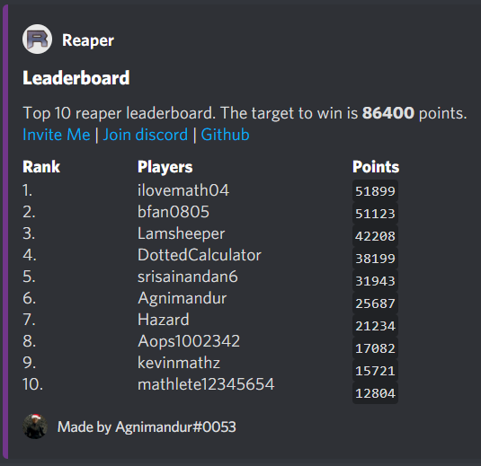

# Red Crab Inn Discord Bot
The primary function of the bot is to play the game *[Reaper](https://artofproblemsolving.com/reaper)*, a math game created by folks at AOPS. Reaper is a game of strategy and patience, and anywhere from 2 to over a thousand players can play! Depending on the type of game you want, a Reaper game might last as little as 2 minutes to as much as several months! This bot is hosted on [Repl.it](https://repl.it/~).
The bot is also on [top.gg](https://top.gg/), the most comprehensive listing of Discord Bots on the Internet! You can find it **[here](https://top.gg/bot/791162942459478016)**.

To add this bot to your discord server, use **[this link](https://discord.com/api/oauth2/authorize?client_id=791162942459478016&permissions=2080894065&scope=bot)**. A list of Reaper specific commands are at the bottom of this README.

#### $quote
Receive an inspirational quote.

#### $trump
Receive a Donald Trump quote.

#### $kanye
Receive a Kanye West quote.

#### $ron
Receive a Ron Swanson (Parks and Recreation character) quote.

#### $what happened in [yr]?
Find out what happened in the given [yr]. Put in a negative number for a BC year.

#### $mathtrivia
Get some math trivia about a natural number.

#### $servers
Find the number of servers and people that this bot has reached.

#### $reaper
A server admin can use this command to create a reaper channel in your discord server and initialize the game.
The following commands only work in the #reaper or #reaper-discussion channel.

#### $leave
A server admin can use this command to purge the Red Crab Inn and all its creations from your server.

 

## Reaper Game Commands

#### begin game h=[h] p=[p] rng=[rng]
An admin starts a new Reaper game. The reap cooldown is [h] hours, and the first to reach [p] points wins. If [rng] is 0, then there will be no random reap multipliers or free reaps! All parameters are optional. The default value of [h] is 12, [p] is 43200 (12 hours to reap), and [rng] is 1 (enabled).

#### begin blitz game s=[s] p=[p] rng=[rng]
An admin starts a new **Blitz** Reaper game. The reap cooldown is [s] seconds, and the first to reach [p] points wins. The difference between blitz and standard games is that in blitz, players play continuously from the beginning to the end of the game. Blitz games usually last from 2 minutes to an hour. In blitz reaper, keeping track of your opponent's timers is critical! The default value of [s] is 10, [p] is 120 (2 minutes to reap), and [rng] is 1 (enabled).

#### h=[h] or s=[s]
An admin changes the reap cooldown to [h] hours (standard games only) or [s] seconds (blitz games only).

#### p=[p]
An admin changes the point target to [p]. If a player is already at [p] points, he still needs to reap once to win!

#### rng=[rng]
If [rng]=0, then randomness is disabled. If [rng]=1, then randomness is enabled.

#### end game
An admin forcibly ends the ongoing game.

#### reset [users]
An admin can type "reset" along with @ing a list of [users] to manually reset all their scores to 0.

#### adminify [users]
An admin can make the @ed users admins!

#### demote [users]
A **server administrator** can use this command to take away the reaper-admin role from the @ed users.

#### ban [users]
Ban the @ed users from typing in the #reaper or #reaper discussion channel.

#### unban [users]
Unban the @ed users.

 

#### reap
Any player can reap! If this is your first reap, you will automatically join the standings. Your cooldown will also begin. You may get bonus points, or free reaps!

The number of points you get is the number of seconds between the time of your reap and the time of the last reap. You will need to maximize this time, since you will only get to reap occasionally. Try to avoid getting "sniped", which is when someone reaps a few seconds before you, causing you to waste your reap on very few points. Perfect timing is key to success!

#### timer
Find the current point value of a reap (in milliseconds).

#### leaderboard
Find the current top10 leaderboard in an ongoing game, displayed as a fancy Embed!

#### nextreap=[name]
Find the time remaining before you can reap again. If the optional [name] parameter is provided, it finds the time before the next reap of person [name].

#### rank=[name]
Find out your current point total, and your current rank in the game! If the optional [name] parameter is provided, it finds the score of all the people whose name begins with [name]. [name] must be at least 4 characters long.

 

## Cryptocurrency Simulator Commands

#### join
Join the ongoing cryptocurrency simulation with a million dollars.

#### exchange rate
Find the current exchange rate of bitcoins and ethereums to US dollars. The rate is updated every minute!

#### leaderboard
Find the current top10 leaderboard of the server's most successful whales!

#### buy/sell [btc] [eth]
If possible, buy or sell the amount specified by the parameter tags. if [all] is passed in, it buys or sells as much as possible of the specified cryptocurrency. For example, *sell btc=2 eth=all* would sell 2 of your bitcoins and all of your ethereum.

#### rank=[name]
Find out your current net worth, and rank in the ongoing Cryptocurrency simulation! If the optional [name] parameter is provided, it finds the net worth of all the people whose name begins with [name]. [name] must be at least 4 characters long.
